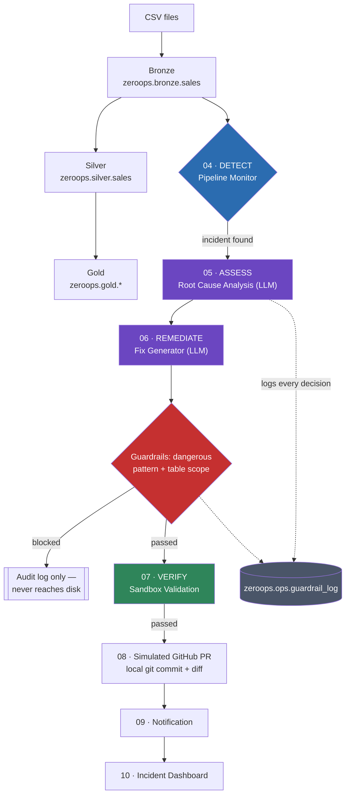

# ZeroOps for Databricks — An Independent, Open-Source Implementation

**An AI-assisted, self-healing DataOps pipeline built from primitives on Databricks Free
Edition: a background process that detects pipeline incidents, diagnoses root cause with
an LLM, generates and safely validates a fix in a sandbox, and packages the result as a
pull request — with a guardrails and policy-enforcement layer auditing every AI decision
along the way.**

> **Not affiliated with, endorsed by, or associated with Databricks Inc.** This project
> is an independent implementation built to learn and demonstrate the engineering
> patterns behind autonomous data-operations agents — it is not the official
> [Databricks Genie ZeroOps](https://www.databricks.com/blog/introducing-genie-zeroops)
> product, doesn't use any Databricks proprietary code, and makes no claim of feature
> parity with it. See [Relationship to Databricks Genie ZeroOps](#relationship-to-databricks-genie-zeroops) below.

## Table of contents

- [Overview](#overview)
- [Relationship to Databricks Genie ZeroOps](#relationship-to-databricks-genie-zeroops)
- [Why parts of this build differ from a "normal" internet-enabled deployment](#️-why-parts-of-this-build-differ-from-a-normal-internet-enabled-deployment)
- [Catalog & schema layout](#catalog--schema-layout)
- [Architecture](#architecture)
- [Repository structure](#repository-structure)
- [Dataset design](#dataset-design-data)
- [Setup on Databricks Community / Free Edition](#setup-on-databricks-community--free-edition)
- [Moving further to production](#moving-further-to-production)
- [Explicit schema (optional)](#explicit-schema-optional)
- [Guardrails & policy enforcement](#guardrails--policy-enforcement)
- [Résumé / LinkedIn highlights](#résumé--linkedin-highlights)
- [Notes on production quality choices](#notes-on-production-quality-choices-in-this-build)

## Overview

Data pipelines break silently — a schema changes upstream, a cast quietly nulls out
values, a retry duplicates rows — long before anyone notices in a dashboard. This
project implements a four-stage response loop for that problem, run entirely as
Databricks notebooks on the free tier:

**Detect** → **Assess** → **Remediate** → **Verify**

1. **Detect** — a deterministic monitor watches Delta table metrics (row counts, null
   rates, duplicate rates, schema) and raises an incident the moment something drifts.
2. **Assess** — an LLM (or a rule engine, selectable per run) reads the incident and
   writes a root cause, business impact, and a confidence score.
3. **Remediate** — the same LLM (or rule engine) proposes a corrected PySpark fix,
   which is scanned by a guardrails layer before it's allowed anywhere near a commit.
4. **Verify** — the fix is applied to a sandbox clone of the data and validated against
   deterministic before/after metrics — never trusted on the LLM's word alone.

A validated fix is then packaged as a local git branch/commit/diff (ready for a real
GitHub PR), and every incident, AI decision, and guardrail check is logged to an
auditable Delta table.

**What this demonstrates:** medallion architecture design, Unity Catalog governance
(catalogs/schemas/Volumes/grants), safe LLM-in-the-loop code generation, guardrails and
policy enforcement with an audit trail, idempotent pipeline design, and building for a
constrained/free-tier environment without cutting corners on architecture.

## Relationship to Databricks Genie ZeroOps

Databricks announced [Genie ZeroOps](https://www.databricks.com/blog/introducing-genie-zeroops)
at Data + AI Summit 2026 as a background agent, built into the Databricks platform,
that runs the same detect → assess → remediate → verify loop natively — using platform
observability, Unity Catalog lineage, and zero-copy shallow clones for sandboxing. It's
currently in private preview (enterprise-only, request access via your Databricks
account team) and, like the rest of the Genie family, is priced on a consumption basis
beyond a monthly free allowance.

This project is a **from-scratch, independent implementation of the same conceptual
loop**, built entirely on primitives available in Databricks Free Edition: it doesn't
use, call, or depend on Genie ZeroOps in any way, and it can't offer what the official
product offers natively (true Unity Catalog lineage tracing, zero-copy production
clones, model-drift monitoring for ML). What it does offer is a transparent, readable
reference for the pattern — every detection rule, prompt, guardrail check, and sandbox
comparison is plain code you can read top to bottom, which is useful whether or not you
ever get access to the official product.

## ⚠️ Why parts of this build differ from a "normal" internet-enabled deployment

**Classic (cluster-based) Databricks Community Edition has no outbound internet
access**, which blocks calls to `api.openai.com`, `api.github.com`, and Slack/Teams
webhooks. Databricks **Free Edition** (the current rebrand, serverless-only) is
different in one important way: it ships a `system.ai` catalog of **Databricks-hosted,
pay-per-token LLMs** (Claude, GPT-5 variants, Llama, etc. — visible under
*Models → Registered Models* in the workspace UI) that you can call from a notebook by
hitting **this workspace's own URL**, not an external domain — so it works even where
general internet egress is blocked, and it's free under fair-use quotas.

This project uses that for the two AI-reasoning steps, with two fallbacks:

| Step | Primary | Also available | Automatic fallback |
|---|---|---|---|
| 05 Root cause analysis (**Assess**) | Databricks-hosted `system.ai` model (free) | Real OpenAI API (paid, needs internet + key) | Deterministic rule engine |
| 06 Fix generation (**Remediate**) | Databricks-hosted `system.ai` model (free) | Real OpenAI API (paid, needs internet + key) | Rule-based code templates |
| 07 Sandbox validation (**Verify**) | Deterministic pass/fail (always) | LLM writes a plain-English narrative + embedding-based semantic drift check on top | Templated sentence; semantic check skipped |
| 08 GitHub PR creation | Real local `git init/commit/diff` | — | (push/API call needs real internet either way) |
| 09 Notification | Written to a Delta table + printed | — | (webhook call needs real internet either way) |

Select the backend for 05/06/07 with the `llm_backend` widget:
`databricks_llm` (default) / `openai` / `rule_engine`. If the chosen LLM backend
errors — quota, network, a malformed response — the notebook logs a `WARNING` and
falls back automatically, so a run never hard-fails because of the AI step.

08 and 09 still simulate their internet-dependent half (the actual `git push` /
`POST /pulls` / webhook call), since those need real outbound internet regardless of
which LLM backend you're using; each contains a reference block for wiring that up on
a machine that has it.

Other Free Edition / Community Edition constraints this project respects:
- Serverless-only compute (Free Edition) or a single auto-terminating cluster (classic
  CE) — re-run notebooks in order after an idle timeout; Delta tables persist either way.
- No Databricks Jobs/scheduler on the free tiers — this is designed for manual
  "Run All" per notebook, not automated scheduling.
- No Delta Live Tables — plain Delta tables + explicit notebooks are used instead.
- No custom secret scopes on Free Edition, which is why the `databricks_llm` path
  deliberately avoids needing one (it uses the notebook's own built-in token instead).

## Catalog & schema layout

Everything lives under one Unity Catalog (`catalog_name` widget in
`00_setup_environment.py`, default **`zeroops`**), split into five schemas:

| Schema | Contains |
|---|---|
| `zeroops.bronze` | Raw ingested data (`sales`) |
| `zeroops.silver` | Cleaned/joined/deduped data (`sales`, `sales_quarantine`, `unmapped_columns`) |
| `zeroops.gold` | Business aggregations (`daily_sales`, `monthly_revenue`) |
| `zeroops.ops` | ZeroOps metadata — not part of the medallion layers, so it gets its own schema: `run_history`, `incident_log`, `ai_analysis`, `ai_fix`, `validation_results`, `github_pr_history`, `notifications`, `guardrail_log` |
| `zeroops.sandbox` | Per-incident validation clones, created dynamically by notebook 07 (`sales_validation_<incident_short_id>`) |

Every table name in the project is built from `CONFIG["tables"]` in
`00_setup_environment.py` — change the `catalog_name` widget and every notebook
follows without any other code changes.

### File storage: Unity Catalog Volumes, not DBFS

Community Edition/Free Edition workspaces increasingly restrict direct `dbfs:/` root
access, so this project stores every file in two **Unity Catalog Volumes** instead of
`/FileStore`:

| Volume | Path | Contains |
|---|---|---|
| `zeroops.bronze.landing` | `/Volumes/zeroops/bronze/landing` | Input CSVs — upload `data/*.csv` here |
| `zeroops.ops.artifacts` | `/Volumes/zeroops/ops/artifacts` | The simulated git repo (`repo_sim/`), generated fix code (`generated_fixes/`), PR diffs/descriptions (`pr_artifacts/`), and the reference prompt files (`prompts/`) |

Both volumes are created automatically by `ensure_catalog_and_schemas()` in
`00_setup_environment.py`, and are read/written directly with plain Python `open()`
or `dbutils.fs` — no `/dbfs` prefix needed, unlike DBFS FileStore paths.

To grant another user or group read access to the input-data volume (not needed on a
single-user workspace, since you own everything you create — useful once this is
shared with a team or run in a paid workspace):
```python
grant_volume_read_access("some_user@example.com")   # defined in 00_setup_environment
```
or the SQL equivalent in `ddl/create_zeroops_schema.sql`.

## Architecture



<details>
<summary>Plain-text version</summary>

```
                CSV Files (data/*.csv)
                    │
                    ▼
        zeroops.bronze.sales           (01_bronze_ingestion)
                    │
                    ▼
        zeroops.silver.sales           (02_silver_transformation — contains
                    │                    two intentional bugs, on purpose)
                    ▼
        zeroops.gold.daily_sales /     (03_gold_pipeline)
        zeroops.gold.monthly_revenue
                    │
                    ▼
          Pipeline Monitor              (04_pipeline_monitor)
          → zeroops.ops.incident_log
                    │
      ┌─────────────┼─────────────┐
      ▼             ▼             ▼
 Error Detection  Root Cause    Fix Generator
  (04)            (05, LLM or   (06, LLM or
                   rule engine)  rule templates)
      │             │             │
      └─────────────┼─────────────┘
                    ▼
          Sandbox Validation         (07_sandbox_validation
                    │                 → zeroops.sandbox.*)
                    ▼
      Simulated GitHub PR            (08_create_github_pr — local git only)
                    │
                    ▼
      Simulated Notification         (09_notification — Delta table + print)
                    │
                    ▼
        Incident Dashboard           (10_incident_dashboard)
```

</details>

## Repository structure

```
AI-ZeroOps/
├── notebooks/
│   00_setup_environment.py     shared config, catalog/schema creation, helpers
│   01_bronze_ingestion.py      CSV -> zeroops.bronze.sales
│   02_silver_transformation.py cast/join/dedupe (contains 2 intentional bugs)
│   03_gold_pipeline.py         daily/monthly aggregations
│   04_pipeline_monitor.py      schema drift / null / duplicate / row-count checks
│   05_root_cause_analysis_ai.py  LLM (Databricks/OpenAI) or rule engine
│   06_fix_generator.py         LLM or rule-based fix code generator + guardrails
│   07_sandbox_validation.py    clone into zeroops.sandbox + apply fix + compare
│   08_create_github_pr.py      local git branch/commit/diff (no push)
│   09_notification.py          Delta table + printed alert (no webhook)
│   10_incident_dashboard.py    unified lifecycle + guardrail audit view
├── ddl/
│   create_zeroops_schema.sql   explicit catalog/schema/table DDL (optional)
├── data/
│   sales_batch1.csv            clean baseline batch (200 rows)
│   sales_batch2_bad.csv        batch with schema drift, cast errors, null
│                                spike, and duplicate spike (165 rows)
│   store_lookup.csv            store_id -> region mapping
├── prompts/
│   root_cause.txt              the production LLM prompt (documentation)
│   code_fix.txt                the production LLM prompt (documentation)
├── config/
│   settings.json               documents the same config the notebooks embed inline
├── LICENSE                     MIT, with a Databricks-trademark disclaimer
└── README.md
```

## Dataset design (`data/`)

`sales_batch1.csv` is a clean 5-day, 200-row baseline across 5 stores and 8 products.

`sales_batch2_bad.csv` (165 rows) intentionally reproduces four real-world upstream
failure modes so the monitor has something genuine to catch:

1. **Schema drift** — a new `discount_code` column appears that Bronze wasn't expecting.
2. **Cast failure** — 12 rows have `quantity = "N/A"` instead of a number.
3. **Null spike** — 20 rows have a blank `customer_id`.
4. **Duplicate spike** — the last 15 rows of batch 1 are re-sent, simulating an
   upstream retry with no idempotency key.

## Setup on Databricks Community / Free Edition

1. **Create a cluster / attach serverless compute** (Free Edition is serverless-only;
   classic Community Edition gives you one free cluster — either works).
2. **Run `00_setup_environment.py` once first** (or the DDL script — step 3 below) so
   the `zeroops` catalog, its schemas, and the two volumes (`bronze.landing`,
   `ops.artifacts`) exist. This step needs to happen before uploading data, since
   you're uploading *into* the `bronze.landing` volume.
3. **Upload the dataset into the volume.** In the Databricks UI: **Catalog** →
   `zeroops` → `bronze` → `landing` (Volumes) → **Upload to this volume**, and drop in
   the 3 CSVs from `data/`. Or from a notebook cell:
   ```python
   dbutils.fs.cp("file:/path/to/sales_batch1.csv", "/Volumes/zeroops/bronze/landing/sales_batch1.csv")
   dbutils.fs.cp("file:/path/to/sales_batch2_bad.csv", "/Volumes/zeroops/bronze/landing/sales_batch2_bad.csv")
   dbutils.fs.cp("file:/path/to/store_lookup.csv", "/Volumes/zeroops/bronze/landing/store_lookup.csv")
   ```
4. **Upload the prompt reference files** (optional, only needed if you later wire up
   a real LLM call) to `/Volumes/zeroops/ops/artifacts/prompts/`.
5. **Import the notebooks.** Workspace → *Import* → select all 11 files in
   `notebooks/`, format = "Source", language = Python. Keep them in the same
   workspace folder so `%run ./00_setup_environment` resolves correctly.
6. **(Optional) Run the DDL script** — `ddl/create_zeroops_schema.sql` — in a SQL
   Editor if you want the catalog/schemas/tables/volumes to exist before the first
   notebook run, and/or to grant another user read access to the input-data volume.
   Not required; `00_setup_environment.py` creates everything itself, and every table
   is created on first write.
7. **Run in order**, attaching each to your cluster/serverless compute. Every
   notebook has a `catalog_name` widget (default `zeroops`) in addition to the ones
   listed below — leave it as-is unless you need a different catalog name:
   - `01_bronze_ingestion` with widget `batch_file = sales_batch1.csv`
   - `02_silver_transformation` with widget `source_file_filter = sales_batch1.csv`
   - `03_gold_pipeline`
   - `04_pipeline_monitor` with widget `source_file_filter = sales_batch1.csv`
     (should detect **no incidents** — this batch is clean)
   - Re-run `01` with `batch_file = sales_batch2_bad.csv`
   - Re-run `02` and `04` with `source_file_filter = sales_batch2_bad.csv`
     (this run **will** raise incidents)
   - `05_root_cause_analysis_ai` — leave `llm_backend = databricks_llm` for the free,
     internet-free path, or switch it to `openai` / `rule_engine`
   - `06_fix_generator` — same `llm_backend` widget
   - `07_sandbox_validation` — same widget, only affects the narrative text, not pass/fail
   - `08_create_github_pr`
   - `09_notification`
   - `10_incident_dashboard`

## Moving further to production

- **05/06/07 AI steps**: already live via `databricks_llm` by default. To use real
  OpenAI instead, switch the widget to `openai` and either create a secret scope
  (`databricks secrets create-scope zeroops` + `databricks secrets put-secret zeroops
  openai_api_key`, requires a non-Free-Edition workspace) or set an `OPENAI_API_KEY`
  environment variable on the cluster.
- **08 GitHub PR / 09 Notification**: each has a `### Notes` section explaining exactly
  what's simulated (the `git push` + GitHub API call, and the Slack/Teams webhook POST)
  and what to add — a GitHub token and a webhook URL — to make them fully live from an
  environment with real outbound internet access.

## Explicit schema (optional)

Every table in this project is also created automatically — `00_setup_environment.py`
creates the catalog and its five schemas, and each notebook creates its own table(s)
the first time it writes (`saveAsTable()`, or `MERGE INTO` against an existing one).
You do **not** need to run anything extra to make the pipeline work. If you'd rather
stand up the full catalog/schema/table structure explicitly upfront (useful for
review, documentation, or as a starting point before running any notebook), run
`ddl/create_zeroops_schema.sql` once in a SQL Editor or as a `%sql` cell. It's fully
`IF NOT EXISTS`, safe to re-run, and includes a note at the bottom on wiping just the
`sandbox` schema (or the whole catalog) to reset.

## Guardrails & policy enforcement

This isn't just documentation — every check below is real code that can actually
block an action, and every decision (pass or fail) is written to
`zeroops.ops.guardrail_log` for audit, alongside the config that defines each policy
(`CONFIG["policies"]` in `00_setup_environment.py`).

| Policy | Enforced where | What it does |
|---|---|---|
| **Confidence gate** | `05_root_cause_analysis_ai.py` | Incidents analyzed below `min_confidence_for_auto_pr` (default 0.70) are marked `requires_human_review = True`. They still get a fix generated and validated, but the eventual PR (08) and notification (09) both carry a loud ⚠️ warning instead of looking routine. |
| **Dangerous-code scan** | `06_fix_generator.py` | Every generated fix — LLM or rule-engine — is scanned for banned patterns (`DROP TABLE`, `os.system`, `subprocess.*`, `rm -rf`, `dbutils.secrets`, `exec(`, `eval(`, `GRANT ALL`, etc.). A match sets `guardrail_status = BLOCKED`; the fix is recorded for audit but **never written to disk**, so it can't reach the git commit step in 08. |
| **Table-scope policy** | `06_fix_generator.py` | Any `saveAsTable(...)` call in generated code must target a table under the `zeroops` catalog. A violation also sets `guardrail_status = BLOCKED`. This is defense-in-depth on top of 07's design (which only ever runs a small set of hand-vetted transformation functions regardless of what the generated text says). |
| **Data-minimization** | `05_root_cause_analysis_ai.py` | `redact_pii()` strips values of configured PII-like columns (e.g. `customer_id`) out of any text before it's sent to an LLM prompt. |
| **Semantic drift check** | `07_sandbox_validation.py` | Mechanical checks (row count, nulls, duplicates) can't catch a fix that quietly changes what a metric *means* — e.g. narrowing which rows count toward revenue. This check embeds the fix's code against `CANONICAL_METRIC_CONTRACT` (a plain-English description of what the metric should mean) using a free Databricks-hosted embedding model (`bge-large-en`), and flags `requires_semantic_review = True` below `min_semantic_similarity` (default 0.85) — independent of, and in addition to, the confidence gate. Fails safe: if the embedding call itself errors, it's treated as drifted rather than silently skipped. |
| **Human-approval policy** | `08_create_github_pr.py` | No notebook in this project ever pushes a branch or calls the GitHub API to merge anything — a human always does that step manually. Low-confidence fixes get an explicit banner in the PR description on top of that baseline. |
| **Rule-based logic (04)** | `04_pipeline_monitor.py` | The monitor itself is pure if/then threshold logic (row-count swing, null %, duplicate %, schema drift) — no ML, no LLM, fully deterministic and auditable. |

Query the audit trail directly:
```sql
SELECT policy, decision, count(*) FROM zeroops.ops.guardrail_log GROUP BY policy, decision;
SELECT * FROM zeroops.ops.guardrail_log WHERE decision = 'BLOCK' ORDER BY logged_at DESC;
```
Notebook 10's dashboard has a dedicated **Guardrails & policy enforcement audit
trail** section that shows the same thing visually.

## Résumé / LinkedIn highlights

**CV bullet points:**

> **ZeroOps for Databricks — Independent, Open-Source Implementation**
> - Designed and built an autonomous DataOps pipeline implementing a detect → assess →
>   remediate → verify agentic loop for a Delta Lake ETL pipeline, entirely on
>   Databricks' free tier.
> - Built deterministic data-quality monitoring (schema drift, null spikes, duplicate
>   detection, row-count anomalies) across a Bronze/Silver/Gold Unity Catalog design.
> - Designed a pluggable AI reasoning layer — a free Databricks-hosted LLM
>   (`system.ai` Foundation Model API), a paid OpenAI path, and a deterministic rule
>   engine — all sharing one output schema so callers don't need to know which
>   produced a result.
> - Implemented a sandbox validation gate that clones data into an isolated Unity
>   Catalog schema and compares deterministic before/after metrics, rather than
>   trusting AI-generated fixes on their word.
> - Built a guardrails/policy-enforcement layer — confidence gating, dangerous-code
>   pattern scanning, table-scope enforcement, PII redaction — with every decision
>   written to an auditable Delta table.
> - Automated Git branch/commit/diff generation for validated fixes, packaged as a
>   review-ready PR description.
> - Technologies: Databricks, Unity Catalog (catalogs/schemas/Volumes/grants), Delta
>   Lake, PySpark, LLM APIs, Git, SQL DDL.

**Ready-to-paste LinkedIn post draft:**

> I built an open-source, independent implementation of the "ZeroOps" pattern for data
> pipelines — inspired by Databricks' newly announced Genie ZeroOps, built entirely on
> Databricks Free Edition.
>
> The idea: a pipeline should detect its own incidents, diagnose root cause, propose a
> fix, and prove the fix works — before a human ever gets paged.
>
> What it does, end to end:
> 🔎 Detect — deterministic monitoring catches schema drift, null spikes, duplicate
> spikes, and row-count anomalies in a Delta Lake pipeline
> 🧠 Assess — an LLM (Databricks-hosted, free tier) diagnoses root cause and business
> impact with a confidence score
> 🛠️ Remediate — the same LLM proposes a fix, which is scanned by a guardrails layer
> (dangerous-code patterns, table-scope enforcement) before it's ever written to disk
> ✅ Verify — the fix is tested against a sandboxed clone and validated with
> deterministic metrics — never trusted on the AI's word alone
> 📝 Every incident, AI decision, and guardrail check is logged to an auditable table
>
> This isn't the official Databricks product (that's in private preview, enterprise-only,
> and consumption-priced) — it's my own from-scratch build of the same conceptual loop,
> to understand the pattern well enough to implement it myself.
>
> Code, DDL, and full write-up on GitHub: [your repo link]
>
> #Databricks #DataEngineering #MLOps #DataOps #UnityCatalog #AIAgents


## Notes on production quality choices in this build

- **Idempotent Silver writes** via `MERGE INTO ... ON order_id` rather than blind
  appends, so re-running a batch (or the duplicate-spike scenario) doesn't double-count.
- **No `exec()` of AI-generated code.** `07_sandbox_validation.py` maps `error_type` to
  a small set of hand-vetted transformation functions instead of executing an arbitrary
  generated string — a deliberate, documented safety trade-off (see the notebook's
  docstring) rather than an oversight.
- **Config centralized in one dict** (`CONFIG` in `00_setup_environment.py`), mirrored
  in `config/settings.json` for readability/documentation purposes.
- **Structured logging** via a `log()` helper (stands in for shipping to a real
  observability sink like Datadog/Azure Monitor in production).
